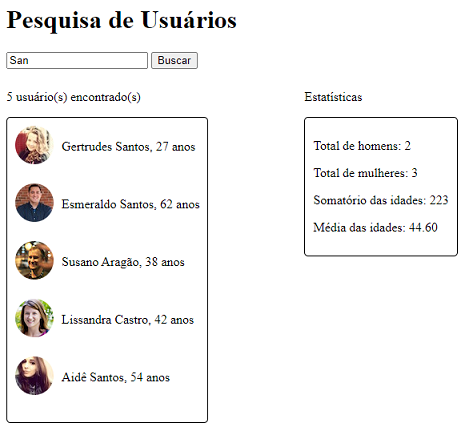

# SearchUsers
Desafio do Módulo I do Bootcamp Fullstack Developer do [IGTI](https://igti.com.br).

Este aplicativo consome, com o auxílio do Javascript, uma API livre e open source conhecida como [Random User Generator](https://randomuser.me).
Em seguida, permite que o usuário pesquise pessoas pelo nome para mostrar alguns dados estatísticos sobre o resultado.

## Instruções
Para iniciar o aplicativo, abra o `index.html` no seu navegador da web.

Insira o termo de pesquisa e clique no botão ou pressione a tecla Enter.

## Tecnologias utilizadas
- HTML
- CSS
- JavaScript

## Outros recursos
- API [Random User Generator](https://randomuser.me)

## Screenshots

